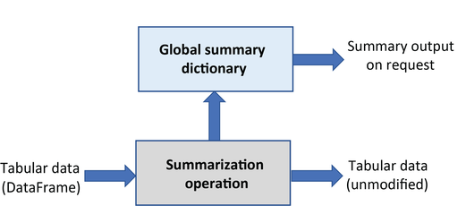
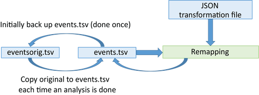

(quickstart-anchor)=

# Quickstart guide

This tutorial introduces the table-remodeler tools for restructuring tabular (`.tsv`) files. The tools are particularly useful for transforming event files from experimental logs and reorganizing data to enable specific analyses.

The remodeling tools are written in Python and designed to operate on entire datasets. Datasets can be in [BIDS format](https://bids.neuroimaging.io/) or any directory structure containing tabular files with a particular suffix (e.g., `_events.tsv`). The tools support multiple execution modes: command-line scripts, Python programs, Jupyter notebooks, or online tools for debugging.

This quickstart covers the core concepts of remodeling with practical examples. For comprehensive operation details, see the [**Complete operations reference**](./complete_operations_reference.md) and [**User guide**](./user_guide.md).


## Table of contents

- [**What is remodeling?**](what-is-remodeling-anchor)
- [**Types of operations**](types-of-operations-anchor)
- [**The remodeling process**](the-remodeling-process-anchor)
- [**JSON remodeling files**](json-remodeling-files-anchor)
  - [**Basic operation syntax**](basic-remodel-operation-syntax-anchor)
  - [**Applying multiple operations**](applying-multiple-remodel-operations-anchor)
  - [**Complex example: AOMIC stop-signal task**](more-complex-remodeling-anchor)
  - [**Remodeling file locations**](remodeling-file-locations-anchor)
- [**Using the tools**](using-the-remodeling-tools-anchor)
  - [**Online tools for debugging**](online-tools-for-debugging-anchor)
  - [**Command-line interface**](the-command-line-interface-anchor)
  - [**Jupyter notebooks**](jupyter-notebooks-for-remodeling-anchor)


(what-is-remodeling-anchor)=

## What is remodeling?

**Remodeling** is the process of transforming tabular files to disambiguate information, facilitate analysis, or reorganize data structure. Although remodeling can be applied to any tab-separated value (`.tsv`) file, it is most commonly used for restructuring event files.

Event files consist of time markers linked to an experimental timeline, providing a bridge between experimental events and recorded data. Initially created from experiment control software log files, event files mark time points when something changes or happens (stimulus onset/offset, participant responses, etc.). These markers identify data portions for analysis or comparison.

Remodeling can occur at several stages during data acquisition and processing:


Beyond initial structuring, event file restructuring may be necessary when files don't suit particular analysis requirements. The table-remodeler tools support this iterative restructuring process.

(types-of-operations-anchor)=

## Types of operations

Remodeling operations fall into two categories:

**Transformation operations** modify the tabular files by restructuring their content. They process an input DataFrame and return a transformed DataFrame without modifying the original data. Transformations are stateless and include:


- **Clean-up**: Remove/rename/reorder columns, remove rows
- **Factor**: Extract condition variables and design matrices
- **Restructure**: Merge consecutive events, remap values, split trial-encoded rows

**Summarization operations** extract information without modifying the input DataFrame. They analyze files and produce summary reports stored separately:



- Column name and value summaries
- HED tag and validation summaries
- Definition summaries
- Sidecar template generation

The following table summarizes all available operations:


(summary-of-operations-anchor)=

```{table} Summary of table-remodeler operations.
| Category | Operation | Example use case |
| -------- | ------- | -----|
| **clean-up** |  |  | 
|  | [*remove_columns*](complete_operations_reference.md#remove-columns) | Remove temporary columns created during restructuring. |
|  | [*remove_rows*](complete_operations_reference.md#remove-rows) | Remove rows with a particular value in a specified column. |
|  | [*rename_columns*](complete_operations_reference.md#rename-columns) | Make columns names consistent across a dataset. |
|  | [*reorder_columns*](complete_operations_reference.md#reorder-columns) | Make column order consistent across a dataset. |
| **factor** |   |   | 
|  | [*factor_column*](complete_operations_reference.md#factor-column) | Extract factor vectors from a column of condition variables. |
|  | [*factor_hed_tags*](complete_operations_reference.md#factor-hed-tags) | Extract factor vectors from search queries of HED annotations. |
|  | [*factor_hed_type*](complete_operations_reference.md#factor-hed-type) | Extract design matrices and/or condition variables. |
| **restructure** |  |  | 
|  | [*merge_consecutive*](complete_operations_reference.md#merge-consecutive) | Replace multiple consecutive events of the same type<br/>with one event of longer duration. |
|  | [*remap_columns*](complete_operations_reference.md#remap-columns) | Create *m* columns from values in *n* columns (for recoding). |
|  | [*split_rows*](complete_operations_reference.md#split-rows) | Split trial-encoded rows into multiple events. |
| **summarization** |  |  | 
|  | [*summarize_column_names*](complete_operations_reference.md#summarize-column-names) | Summarize column names and order in the files. |
|  | [*summarize_column_values*](complete_operations_reference.md#summarize-column-values) |Count the occurrences of the unique column values. |
|  | [*summarize_definitions*](complete_operations_reference.md#summarize-definitions) |Summarize definitions used and report inconsistencies. |       
|  | [*summarize_hed_tags*](complete_operations_reference.md#summarize-hed-tags) | Summarize the HED tags present in the  <br/> HED annotations for the dataset. |
|  | [*summarize_hed_type*](complete_operations_reference.md#summarize-hed-type) | Summarize the detailed usage of a particular type tag <br/> such as *Condition-variable* or *Task* <br/> (used to automatically extract experimental designs). |
|  | [*summarize_hed_validation*](complete_operations_reference.md#summarize-hed-validation) | Validate the data files and report any errors. | 
|  | [*summarize_sidecar_from_events*](complete_operations_reference.md#summarize-sidecar-from-events) | Generate a sidecar template from an event file. | 
```

For detailed parameter descriptions and examples of each operation, see the [**Complete operations reference**](./complete_operations_reference.md).


(the-remodeling-process-anchor)=

## The remodeling process

Remodeling applies a list of operations to tabular files to restructure or extract information. The following diagram shows the complete workflow:



### Backup system

Initially, you create a backup of the tabular files you plan to remodel. This backup is performed once and stored in the `derivatives/remodel/backups` subdirectory of your dataset. The backup structure mirrors your original file organization:


**Important:** The remodeling process always reads from the backup and writes to the original file location. This means:
- You can iterate on your remodeling operations without fear of losing data
- Rerunning operations always starts from the original backup
- You can correct mistakes in your remodeling script and rerun

### Remodeling workflow

1. **Create backup** (one time): Use `run_remodel_backup` to create the baseline backup
2. **Create remodeling file**: Write JSON file with your operations (typically named `*_rmdl.json`)
3. **Run remodeling**: Execute `run_remodel` which:
   - Reads files from backup directory
   - Applies operations sequentially
   - Writes transformed files to original locations
   - Saves summaries to `derivatives/remodel/summaries`
4. **Iterate**: Modify your JSON file and rerun as needed

By convention, remodeling files are stored in `derivatives/remodel/remodeling_files` with names ending in `_rmdl.json`.

### Checkpointing with named backups

Advanced users can create multiple named backups to use as checkpoints:

```python
# Create a checkpoint after initial cleanup
run_remodel_backup data_dir --backup-name "after_cleanup"

# Later, restore from that checkpoint
run_remodel_restore data_dir --backup-name "after_cleanup"
```

This is useful when developing different versions of remodeling for different purposes.


(json-remodeling-files-anchor)=

## JSON remodeling files

The operations to restructure a tabular file are stored in a remodel file in JSON format. The file consists of a list of JSON dictionaries.

(basic-remodel-operation-syntax-anchor)=

### Basic operation syntax

Each operation is specified as a JSON dictionary with three components: the operation name, a description, and parameters. Here's a simple example that renames a column:

````{admonition} Example of a rename operation.
---
class: tip
---
```json
{ 
    "operation": "rename_columns",
    "description": "Rename trial_type column to event_type for consistency",
    "parameters": {
        "column_mapping": {
            "trial_type": "event_type"
        },
        "ignore_missing": true
    }
}
```
````

Each operation has its own specific required and optional parameters. For *rename_columns*:
- **column_mapping** (required): Dictionary mapping old names to new names
- **ignore_missing** (required): If `true`, don't error when a column doesn't exist

See the [**Complete operations reference**](./complete_operations_reference.md) for detailed parameter documentation.


(applying-multiple-remodel-operations-anchor)=

### Applying multiple operations

A remodeling JSON file contains a list of operations executed sequentially. Each operation sees the result of previous operations. For example, here we rename columns and then summarize the result:

````{admonition} Multiple operations in sequence.
---
class: tip
---
```json
[
    { 
        "operation": "rename_columns",
        "description": "Rename trial_type to event_type for consistency.",
        "parameters": {
            "column_mapping": {
                "trial_type": "event_type"
            },
            "ignore_missing": true
        }
    },
    {
        "operation": "summarize_column_names",
        "description": "Verify column names after renaming.",
        "parameters": {
            "summary_name": "Columns after remodeling",
            "summary_filename": "columns_after_remodel"
        }      
    }
]
```
````

**Important:** Remodeling always starts from the backup. If you run this script multiple times, each run begins with the original backup files, applies all operations in order, and overwrites the data files (but not the backup). This means you can safely iterate on your remodeling script.


(more-complex-remodeling-anchor)=

### Complex example: AOMIC stop-signal task

This section demonstrates a realistic remodeling scenario using an excerpt from the AOMIC-PIOP2 dataset (ds002790 on [OpenNeuro](https://openneuro.org)):

(sample-remodeling-events-file-anchor)=

```{admonition} Excerpt from AOMIC stop-signal task event file.
| onset | duration | trial_type | stop_signal_delay | response_time | response_accuracy | response_hand | sex |
| ----- | -------- | ---------- | ----------------- | ------------- | ----------------- | ------------- | --- |
| 0.0776 | 0.5083 | go | n/a | 0.565 | correct | right | female |
| 5.5774 | 0.5083 | unsuccesful_stop | 0.2 | 0.49 | correct | right | female |
| 9.5856 | 0.5084 | go | n/a | 0.45 | correct | right | female |
| 13.5939 | 0.5083 | succesful_stop | 0.2 | n/a | n/a | n/a | female |
| 17.1021 | 0.5083 | unsuccesful_stop | 0.25 | 0.633 | correct | left | male |
| 21.6103 | 0.5083 | go | n/a | 0.443 | correct | left | male |
```

#### Understanding the task

This stop-signal task presented faces to participants who decided the sex by pressing a button (left/right hand). However, if a stop signal occurred, participants should refrain from responding.

#### The problem: Trial-level vs. event-level encoding

The file uses **trial-level encoding**: each row represents an entire trial with multiple events encoded as offsets:
- The `onset` column marks the face presentation (go signal)
- The `stop_signal_delay` column contains the offset to the stop signal (if present)
- The `response_time` column contains the offset to the button press (if present)

For many analyses, **event-level encoding** is preferable: each row represents a single event.

#### The solution: split_rows operation

The `split_rows` operation converts trial encoding to event encoding:


````{admonition} Splitting trial-level rows into events.
---
class: tip
---
```json
[
    {
        "operation": "split_rows",
        "description": "Convert from trial encoding to event encoding.",
        "parameters": {
            "anchor_column": "trial_type",
            "new_events": {
                "response": {
                    "onset_source": ["response_time"],
                    "duration": [0],
                    "copy_columns": ["response_accuracy", "response_hand"]
                },
                "stop_signal": {
                    "onset_source": ["stop_signal_delay"],
                    "duration": [0.5]
                }
            },
            "remove_parent_row": false
        }    
    }
]
```
````

#### Understanding the parameters

**anchor_column**: Specifies which column receives the new event type values (`trial_type` in this case). Since `remove_parent_row` is `false`, the original trial row remains.

**new_events**: Dictionary where each key is a new event type name. Each event specification has:

- **onset_source**: List of column names and/or numbers to compute the new event's onset. Values are added to the parent row's onset. Column names are evaluated; if any value is `n/a` or missing, no new event is created.
  - `["response_time"]` → new onset = parent onset + value in response_time column
  - `["stop_signal_delay"]` → new onset = parent onset + value in stop_signal_delay column

- **duration**: Duration for the new event (0 for button presses, 0.5 for stop signal)

- **copy_columns** (optional): Columns to copy from parent row to new row. For response events, we copy `response_accuracy` and `response_hand`. Other columns are filled with `n/a`.

#### Result

After remodeling, trials with responses will have additional rows for the response event. Trials with stop signals will have additional rows for the stop signal. The tool automatically handles missing values (`n/a`) without creating spurious events.

You can find the complete remodeling file at: [**AOMIC_splitevents_rmdl.json**](./_static/data/AOMIC_splitevents_rmdl.json)


(remodeling-file-locations-anchor)=

### Remodeling file locations

When executing remodeling operations, provide the full path to the JSON remodeling file. However, it's good practice to organize remodeling files within your dataset:

**Recommended directory structure:**
```
dataset_root/
├── sub-0001/
│   └── ...
├── derivatives/
│   └── remodel/
│       ├── backups/          # Created automatically by run_remodel_backup
│       │   └── default/      # Default backup name (or custom names)
│       ├── remodeling_files/ # Store your *_rmdl.json files here
│       │   ├── cleanup_rmdl.json
│       │   ├── split_trials_rmdl.json
│       │   └── summarize_rmdl.json
│       └── summaries/        # Created automatically by summarization operations
│           ├── column_names_summary.txt
│           └── column_values_summary.json
```

This organization keeps all remodeling-related files together and provides a clear record of transformations applied to your dataset.


(using-the-remodeling-tools-anchor)=

## Using the tools

The table-remodeler provides several ways to execute remodeling operations: online tools for debugging, command-line scripts for batch processing, and Python/Jupyter for programmatic control.

(online-tools-for-debugging-anchor)=

### Online tools for debugging

Before running remodeling on an entire dataset, test your operations on a single file using the [**HED online tools**](https://hedtools.org/hed/).

**Steps to use the online remodeler:**

1. Navigate to the **Events** page
2. Select the **Execute remodel script** action
3. Upload your data file (`.tsv`) and JSON remodel file (`*_rmdl.json`)
4. Press **Process**


**Results:**
- **If errors exist**: Downloads a text file with error descriptions
- **If successful (transformations only)**: Downloads the remodeled data file
- **If successful (with summaries)**: Downloads a zip file containing the remodeled data file and summary files

**For HED operations:** Also upload a JSON sidecar file containing HED annotations if using operations like `factor_hed_tags`, `summarize_hed_validation`, or other HED-dependent operations.

The online tools are ideal for:
- Debugging JSON syntax errors
- Verifying operation parameters
- Previewing transformation results
- Testing with small data samples


(the-command-line-interface-anchor)=

### Command-line interface

After [**installing table-remodeler**](./user_guide.md#installation), you can process entire datasets using the command-line scripts.

#### Installation

```bash
pip install table-remodeler
```

#### Available commands

Three command-line tools are provided:

1. **run_remodel_backup**: Create backup of tabular files (run once per dataset)
2. **run_remodel**: Execute remodeling operations
3. **run_remodel_restore**: Restore files from backup

#### Basic usage example

```bash
# Step 1: Create backup (one time)
run_remodel_backup /data/my_dataset

# Step 2: Run remodeling operations
run_remodel /data/my_dataset /data/my_dataset/derivatives/remodel/remodeling_files/my_operations_rmdl.json -b -x derivatives

# Step 3: Check the summaries
ls /data/my_dataset/derivatives/remodel/summaries/
```

#### Common parameters

The `run_remodel` command accepts:

- **data_dir** (positional, required): Root directory of the dataset
- **model_path** (positional, required): Path to JSON remodeling file
- **-b, --bids-format**: Treat as BIDS-formatted dataset
- **-x, --exclude-dirs**: Directories to exclude (e.g., `derivatives`)
- **-t, --task-names**: Process only files with specific task names
- **-s, --save-formats**: Formats for summaries (`.txt`, `.json`)
- **-v, --verbose**: Enable verbose output

#### AOMIC dataset example

```bash
run_remodel /data/ds002790 \
  /data/ds002790/derivatives/remodel/remodeling_files/AOMIC_splitevents_rmdl.json \
  -b -s .txt -s .json -x derivatives -t stopsignal
```

This command:
- Processes the ds002790 dataset in BIDS format (`-b`)
- Applies operations from `AOMIC_splitevents_rmdl.json`
- Saves summaries in both text and JSON formats (`-s .txt -s .json`)
- Excludes the derivatives directory (`-x derivatives`)
- Only processes files with `stopsignal` in the filename (`-t stopsignal`)

**Important notes:**
- Always run from backup (default behavior)
- Rerunning `run_remodel` starts fresh from backup each time
- Summaries are saved to `derivatives/remodel/summaries/`
- Original data files are overwritten (but backups remain safe)

For comprehensive command-line documentation, see the [**User guide**](./user_guide.md#command-line-interface).


(jupyter-notebooks-for-remodeling-anchor)=

### Jupyter notebooks

For programmatic control with documentation, use the command-line scripts from within Jupyter notebooks. Example notebooks are available at [**hed-examples/remodeling**](https://github.com/hed-standard/hed-examples/tree/main/src/jupyter_notebooks/remodeling).

These notebooks demonstrate how to:
- Create backups programmatically
- Execute remodeling operations with custom parameters
- Process summaries and visualize results
- Integrate remodeling into analysis pipelines

If you don't have access to a Jupyter environment, see [Six easy ways to run your Jupyter Notebook in the cloud](https://www.dataschool.io/cloud-services-for-jupyter-notebook/) for no-cost cloud options.

## Next steps

Now that you understand the basics of remodeling:

1. **Explore operations**: See the [**Complete operations reference**](./complete_operations_reference.md) for detailed parameter documentation
2. **Learn advanced workflows**: Read the [**User guide**](./user_guide.md) for CLI details, HED integration, and advanced topics
3. **Create custom operations**: See the [**Implementation guide**](./implementation_guide.md) if you need custom remodeling operations
4. **Try examples**: Download example datasets and remodeling files from [**hed-examples**](https://github.com/hed-standard/hed-examples)
